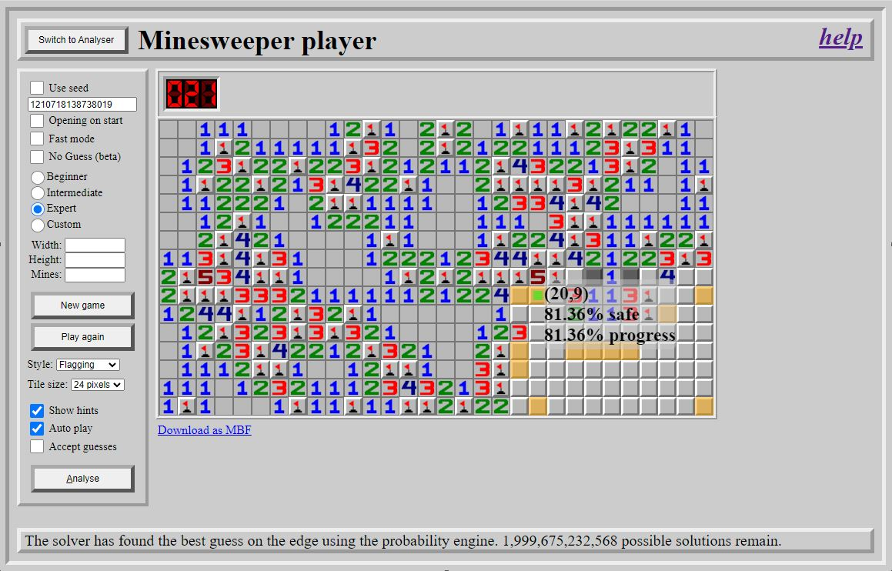

# JSMinesweeper

Play Minesweeper and analyse arbitrary positions at https://davidnhill.github.io/JSMinesweeper/

This readme explains how to use the software and what techniques the solver uses.

## Overview
This is a rewrite of my Java minesweeper solver in javascript. All the processing runs on the host machine. The purpose of the rewrite was to make the solver more accessable since there was reluctance to download a java executable. The trade off is that javascript is significantly slower than java to execute. 

The solver has a 40.7% win rate on classic expert (30x16/99 safe start in a corner) and 54% on modern expert (30x16/99 open start at (3,3)).

## How to use the player

The landing screen provides access to the Minesweeper player.  

Basic Options:
- Opening on start: Determines whether the first click is a guaranteed opening or only guaranteed safe.
- Beginner:  9x9/10.
- Intermediate: 16x16/40.
- Expert: 30x16/99.
- Custom: Define your own board size with a maximum height and width of 200.

Advanced options:
- Fast Mode: Trivial moves are played automatically, leaving only moves with logic to consider.
- Style - Flagging: Put a flag on mines when the solver discovers them.
- Style - No Flagging: Never place flags.
- Style - Efficiency: This option allows the solver to use chording and flags are only placed in an attempt to minimize the number of clicks required to solve the game. **This mode seriously impacts performance.**
- Tile size: use this to select the tile size best suited.  Will take affect next time the game starts or the board is reset.
- Show hints: The solver will shadow your play and highlight safe plays and (if necessary) what it considers the best guess
- Auto play: The solver will play the game for you until a guess is required. The solver will show what it considers the best guess, but you must make the final decision.
- Accept guesses: The solver will play the game until it is won or lost.

The analysis button can be used to force the solver to analyse the current games position.  This is useful if you have turned off all the solver options.

## How to use the Analyser

To access the analyser toggle select the 'Analysis mode' switch and press the *Reset board* button which has replaced the *New Game* button.

To start you are presented with a blank board which is either all *zeros* or all *hidden* depending on the option you have selected.

From here you can construct the position you wish to analyse. This is best done in the following order:
1. Use the left mouse button (or 'h') to toggle a tile from hidden to revealed.
2. Drag the mouse with the left mouse button down to toggle each tile the mouse passes over
3. Use the right mouse button (or 'f') to place and remove flags.  A flag is considered to be a mine by the solver, whether it is *knowable* from the position or not.
4. Placing and removing a flag will automatically adjust the values of revealed tiles adjacent to it.
5. Use the mousewheel to adjust the value of a revealed tile.  Alternatively, use the 0-8 keys. The value is constrained to be a legal value based on the adjacent tiles.
6. Use the mousewheel to adjust the mine count showing how many mines left to find.  The value can be adjusted by 10s or 1s depending on which digit the mouse is over

If the board is valid the **Analyse** button will be enabled and pressing this (or the 'a' key) will start the analyser. 

The safe tiles are shown in green and the mines in red. If no certain move is available then the solver will highlight the move it considers best in yellow with a green centre.  Other moves it considered but rejected are shown in yellow. Tiles highlighted in grey can have only one possible value and it is never correct to play these when there are other moves available.

If you are playing a game and using the analyser to provide assistance then you can keep the mine count in step by selecting "Lock mine count".  Now every time a flag is placed the mine counter is reduced by one.

## High level components

There are three high level components
- The Minesweeper game - this generates the board and is sent moves by the GUI.
- The GUI - gets moves from the Player or the Solver and sends them to the Minesweeper game, who returns the result of the move which is rendered. It also renders information the solver has calculated.
- The Solver - The GUI passes the board state to the solver which calculates a play and returns the move(s) to the GUI, which passes them onto the Minesweeper game.

## How the solver determines the best play

The solver has a number of techniques it uses to solve the board:
- Trivial analysis
- Probability engine
- 50/50 and pseudo-50/50 detection
- Guessing logic
- Brute force analysis

## Trivial Analysis

This is used to quickly find any moves which are trivially discovered:
- A satisfied tile has it's remaining adjacent tiles cleared
- A tile with space only for the remaining mines has the mines identified. Depending on the play style they may not be flagged.

If plays are discovered then processing ends at this stage.  Further analysis might find other options, but equally they might be found trivially in the next iteration of the solver.

## Probability engine

The probability engine calculates the chance that a tile is a mine for every hidden tile on the board.  The calculation is 100% accurate, but this comes at the price of exponential processing cost based on the number of revealed tiles which can be strung together.  This means as the board gets larger and has a higher mine density performance suffers. For example 50x50/500 should be fine, 100x100/2500 might struggle.

As part of the probability engine some tiles can be discovered that are either mines or have only one possible value. These are refered to as **dead tiles** and it is never correct to choose a dead tile unless all the tiles left in the game are dead. In which case the game has no more information to be discovered and the result is down to luck.

## 50/50 and pseudo-50/50 detection

A 2-tile 50/50 is a pair of tiles which share 1 mine where one of the tiles can never receive information without the other tile also receiving the same information.  In this situation there is no way to differentiate between the two tiles and they must be (and always will be) an unavoidable guess with 50% chance of being correct.  Since the 50/50 will never change it is always correct to guess these at the earliest possible moment, since they might provide information to their neighbouring tiles. In practice this processing has a dependency on the probability engine and so the solver can only find these after that has run.

The solver can discover:
- Arbitrarily extended 2-tile 50/50s.  
- Enclosed 2x2/2 boxes

A *pseudo-50/50* is a situation where a set of tiles is either safe or part of a 50/50. If it is part of a 50/50 then it is correct to guess immediately. If it is safe it is correct to guess immediately. 

The solver can discover
- 2-tile pseuso-50/50s
- 4-tile 2x2 pseudo-50/50s

It is unable to discover extended pseudo-50/50s.

## Guessing logic

If the probabilty engine has run and there are no certain plays and no 50/50s then a guess has to be made which isn't a 50/50 punt. At this stage the solver's guessing logic is used.

Each tile within 10% of the safest guess (e.g. safest is 80%, then the cutoff is 80% * 90% = 72%) is analysed to find:
- **Progress percentage** - This is the chance that this move will lead to 100% safe moves being available *next* move.
- **Secondary safety** - This is the likelihood of surviving not only the current move, but also the *next* move.

The progress percentage and the secondary safety are blended together to create a final score. The idea here is that 1) a tile with 90% safety and 10% progress isn't as good as a move with 85% safety and 85% progress and 2) When you don't make progress is there a good guess to follow.  This method is not perfect but has been emperically shown to provide better results than picking the safest tile.

An interesting statistic is that to win a classic expert game of minesweeper the solver is required, on average, to make 3.3 guesses.  From this we can see that once the game has opened up it is common to be a able to make significant progress before a guess is needed again. For higher density boards the number of guesses required goes up and the value of looking for progress diminishes. When the mine density reaches a certain point the tie break switches to choosing the tile which has the best chance of reducing the solution space the most.

## Brute force analysis

The brute force analysis takes a board and (conceptionally) plays every combination of move against every combination of mines and determines the best way to play to maximise the chance of winning.  This algorithm finds a perfect path to play the game, but is hugely processor intensive.  The solver will attempt to use this method when the number of solutions remaining is 750 or less.  If it is successful then we can be certain that the solver has played (one of) the best paths to victory. It also allows the solver to say precisely how likely the game is to be won with best play.

